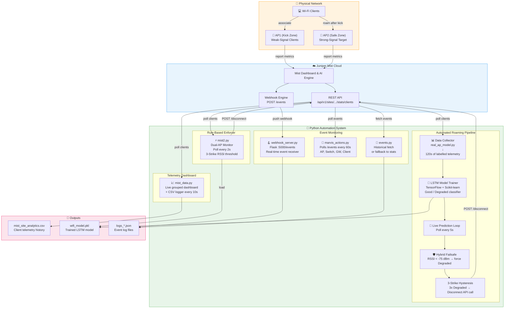

# Juniper Mist — Automated Wi-Fi Client Roaming System

<p align="center">
  
  
  
  
  
</p>

An **AI-powered, API-driven toolkit** that automatically monitors Wi-Fi client connection quality via the **Juniper Mist cloud API** and proactively forces weak clients to roam to a better Access Point (AP) — using a combination of LSTM machine learning, rule-based hysteresis, and real-time telemetry logging.

---

## 🧠 Problem Statement

In enterprise Wi-Fi deployments, clients often exhibit **"sticky client" behaviour** — they remain connected to a distant or overloaded AP with a degraded signal (low RSSI, high retries) instead of roaming to a nearby AP with a stronger signal. This degrades network performance and user experience.

This project solves the problem by:
1. **Continuously polling** Mist telemetry metrics (RSSI, SNR, Tx/Rx rates, retries).
2. **Predicting connection quality** using a trained LSTM neural network.
3. **Automatically disconnecting** (de-authenticating) clients that persistently show poor signal — forcing them to re-associate with the best available AP.

---

## 🏗️ System Architecture



---

## 📂 Repository Structure

```
Juniper-Mist/
│
├── 🤖  Automated Roaming Pipeline
│   ├── real_ap_model.py       # LSTM ML pipeline with hybrid RSSI failsafe (MAIN)
│   └── mist2.py               # Dual-AP rule-based enforcer (loads wifi_model.pkl if present)
│                              # ⚠️  wifi_model.pkl is generated locally by real_ap_model.py
│                              #    and is NOT committed to this repository.
│
├── 📊  Telemetry Dashboard
│   └── mist_data.py           # Live grouped dashboard + CSV logger
│
├── 🪝  Event System
│   ├── webhook_server.py      # Flask webhook receiver (port 5000)
│   ├── marvis_actions.py      # Polling-based event fetcher (all device types)
│   └── events.py              # Historical event fetch with stats fallback
│
├── 🔧  Configuration
│   ├── requirements.txt       # Python dependencies
│   ├── .gitignore             # Excludes tokens, CSVs, and venvs
│   ├── device_setup_commands.md  # Junos CLI commands for SRX300 + EX2300
│   └── mist_architecture.md   # High-level network topology notes
│
└── 📖  README.md
```

---

## ⚡ Quick Start

### 1. Clone the Repository

```bash
git clone https://github.com/NaveenHuggi/Juniper-Mist.git
cd Juniper-Mist
```

### 2. Install Dependencies

```bash
python -m venv .venv
# Windows
.venv\Scripts\activate
# Linux / macOS
source .venv/bin/activate

pip install -r requirements.txt
```

### 3. Set Environment Variables

> ⚠️ **Never hardcode credentials.** Always use environment variables.

```bash
# Windows PowerShell
$env:MIST_API_TOKEN = "your_token_here"
$env:MIST_ORG_ID    = "your_org_id_here"
$env:MIST_SITE_ID   = "your_site_id_here"

# Linux / macOS
export MIST_API_TOKEN="your_token_here"
export MIST_ORG_ID="your_org_id_here"
export MIST_SITE_ID="your_site_id_here"
```

You can find your **API Token** under:  
*Mist Dashboard → Organization → Settings → API Token*

---

## 🚀 Usage Guide

### 🤖 Option A — ML-Powered Roaming (Recommended)

**`real_ap_model.py`** — Full LSTM pipeline:

```bash
python real_ap_model.py
```

**What it does:**
1. **Collects training data** for 120 seconds from all connected clients (walk away from the AP to generate "Degraded" samples).
2. **Trains an LSTM model** on the collected RSSI, SNR, retry-rate, Tx/Rx rate, and channel utilisation data.
3. **Enters live prediction mode** — polls every 5 seconds, predicts client quality, and disconnects any client that remains "Degraded" for 3 consecutive polls.
4. **Hybrid failsafe**: If RSSI drops below `–75 dBm`, the model is overridden and the client is immediately marked Degraded.

**Signal quality display:**
```
[12:34:56] aa:bb:cc:dd:ee:ff | [||...] Fair -72dBm | AI: Good (0.91)
[12:35:01] aa:bb:cc:dd:ee:ff | [|....] Weak -77dBm | AI: Degraded (0.88) [FAILSAFE TRIGGERED]
   >>> STRIKE 1/3
[12:35:06] aa:bb:cc:dd:ee:ff | [.....] CRITICAL -82dBm | AI: Degraded (0.95)
   >>> STRIKE 2/3
...
 >>> [ACTION] DISCONNECTED aa:bb:cc:dd:ee:ff <<<
```

---

### ⚡ Option B — Rule-Based Dual-AP Enforcer

**`mist2.py`** — Simpler, no training needed. Update AP MACs in the script first:

```python
AP1_MAC = "YOUR_AP1_MAC"   # e.g. "04cdc092a8eb"  — clients kicked FROM here
AP2_MAC = "YOUR_AP2_MAC"   # e.g. "04cdc092addc"  — clients should roam TO here
```

```bash
python mist2.py
```

Polls every **2 seconds**. Kicks clients whose RSSI < `–75 dBm` for 3 consecutive polls, and also reports which clients are connected to AP2 (roaming confirmation).

---

### 📊 Telemetry Dashboard & CSV Logging

**`mist_data.py`** — Live dashboard grouped by AP, with CSV export:

```bash
python mist_data.py
```

Output is appended to **`mist_site_analytics.csv`** every 10 seconds, containing 27 columns of telemetry data (RSSI, SNR, latencies, byte counts, etc.).

---

### 🪝 Real-Time Webhook Events

**`webhook_server.py`** — Receives events pushed from the Mist cloud:

```bash
python webhook_server.py
```

Then configure a **Mist Webhook** in the dashboard:  
*Organization → Webhooks → Add Webhook → URL: `http://<your-server-ip>:5000/events`*

Events are saved to:

| File | Contents |
|------|----------|
| `logs_ap_events.json` | AP connect/disconnect, firmware, radio events |
| `logs_switch_events.json` | Switch port up/down, STP events |
| `logs_gateway_events.json` | WAN failover, tunnel events |
| `logs_client_events.json` | Client join/leave, auth, roam events |
| `logs_other_events.json` | Alarms and uncategorised |

---

### 🔎 Historical Event Poller

**`marvis_actions.py`** — Polls Mist API for historical events:

```bash
python marvis_actions.py
```

**`events.py`** — One-shot fetch with automatic fallback to device stats:

```bash
python events.py
```

---

## 📐 Key Configuration Parameters

| Script | Parameter | Default | Description |
|--------|-----------|---------|-------------|
| `real_ap_model.py` | `RSSI_SAFETY` | `-65 dBm` | Signals above this are skipped (Safe) |
| `real_ap_model.py` | `RSSI_CRITICAL` | `-75 dBm` | Hard failsafe — forces Degraded label |
| `real_ap_model.py` | `DEGRADED_THRESHOLD` | `3` | Consecutive degraded polls before kick |
| `real_ap_model.py` | `DATA_COLLECTION_SECONDS` | `120` | Training data collection window |
| `real_ap_model.py` | `SEQ_LEN` | `5` | LSTM input sequence length |
| `mist2.py` | `RSSI_THRESHOLD` | `-75 dBm` | Threshold for rule-based kick |
| `mist2.py` | `STRIKES_REQUIRED` | `3` | Consecutive bad polls before kick |
| `mist2.py` | `POLL_INTERVAL` | `2s` | Frequency of API polling |
| `mist_data.py` | `POLL_INTERVAL` | `10s` | Frequency of telemetry logging |

---

## 🔐 Security Best Practices

- ✅ **Use environment variables** for `MIST_API_TOKEN`, `MIST_ORG_ID`, and `MIST_SITE_ID`.
- ✅ **Never commit** `.env` files or tokens — `.gitignore` is pre-configured.
- ✅ **Rotate your API token** periodically from the Mist dashboard.
- ✅ **Scope your token** to the minimum required permissions (Site → Read + Client Disconnect).

---

## 🛠️ Dependencies

| Package | Purpose |
|---------|---------|
| `requests` | Mist REST API calls |
| `pandas` | Telemetry data processing |
| `numpy` | Numerical arrays for LSTM |
| `tensorflow` | LSTM model training and inference |
| `scikit-learn` | Label encoding and feature scaling |
| `joblib` | Loading the `wifi_model.pkl` file |
| `flask` | Webhook HTTP server |
| `urllib3` | SSL warning suppression |

---

## 🗺️ Related Files

| File | Description |
|------|-------------|
| `device_setup_commands.md` | Full Junos OS CLI commands for SRX300 & EX2300 configuration |
| `mist_architecture.md` | Network topology and zone design notes |
| `Juniper Mist setup.pdf` | Original project setup documentation |

---

## 📜 License

MIT License — see [LICENSE](LICENSE) for details.

---

## 👤 Author

**Naveen Huggi** — [GitHub](https://github.com/NaveenHuggi)

> Built as part of a Juniper Mist AI-driven enterprise networking project demonstrating cloud-managed wireless automation.
